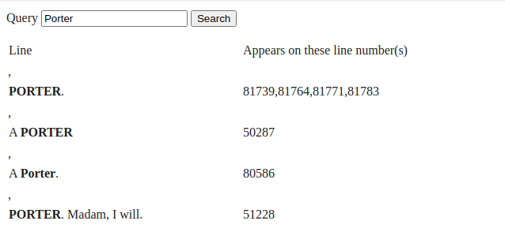

# shakesearch

[](https://goreportcard.com/report/github.com/MicahParks/shakesearch) 

## Test it yourself

This is deployed right now. Head over to [https://shakesearch.micahparks.com](https://shakesearch.micahparks.com) or use
the command line:

```bash
curl "https://shakesearch.micahparks.com/api/search?q=Porter&maxResults=2" | python3 -m json.tool
```

Output:

```
  % Total    % Received % Xferd  Average Speed   Time    Time     Time  Current
                                 Dload  Upload   Total   Spent    Left  Speed
100   165  100   165    0     0    283      0 --:--:-- --:--:-- --:--:--   282
[
    {
        "line": "PORTER.",
        "lineNumbers": [
            81739,
            81764,
            81771,
            81783
        ],
        "matchedIndexes": [
            0,
            1,
            2,
            3,
            4,
            5
        ]
    },
    {
        "line": "A PORTER",
        "lineNumbers": [
            50287
        ],
        "matchedIndexes": [
            2,
            3,
            4,
            5,
            6,
            7
        ]
    }
]
```

## Screenshot

I kept most of the lovely frontend the same, but I fixed up the backend and added new features as instructed.



## New features

* Fuzzy search the given query.
* Rate limit requests.
* Proper error handing.
* Using a logger (zap).
* More data returned from search endpoint.
* Endpoints moved to `/api`. Ex: `/api/search`.
* Deployment assets: `Dockerfile`, `docker-compose.yml`, and `Caddyfile`.
* Swagger 2.0 specification file. See it live
  here: [https://shakesearch.micahparks.com/swagger.json](https://shakesearch.micahparks.com/swagger.json)
* Configurable hostname, port, and file location for Shakespeare's works in the file system.
* Separation of frontend and backend code. (Using Caddy as a file server).
* HTTPS (thanks to Let's Encrypt and Caddy).
* No more panics when a query causes an impossible index. Ex. Search for something near the top or bottom of the file
  like `Project`.
* Bold the text that matched the query.
* Line number where the text came from.
* Less whitespace in memory.
* Limit the number of results using query.

## Configuration

Environment variable table:

|Name                |Description                                                                                |Default Value      |Example Value            |
|--------------------|-------------------------------------------------------------------------------------------|-------------------|-------------------------|
|`HOST`              |The host to bind the service to.                                                           |`localhost`        |`0.0.0.0`                |
|`PORT`              |The port to bind the service to.                                                           |random             |`30000`                  |
|`SHAKESPEARES_WORKS`|The full or relative file path to a text file containing the complete works of Shakespeare.|`completeworks.txt`|`/home/william/works.txt`|

## Generated code and directories explained

This project uses a swagger 2.0 API (`swagger.yml`) and
the [goswagger project](https://github.com/go-swagger/go-swagger). The `swagger.yml` file was used to generate the code
in the `cmd`, `models`, and `restapi` directories. One file was edited at `restapi/configure_shakesearch.go`.

The other directories are not from the code generator. Both `configure` and `endpoints` contain hand written code and
the `static` directory was given, except `static/app.js` was modified a bit to help show matching results with bold
text.
